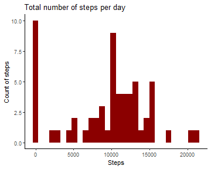
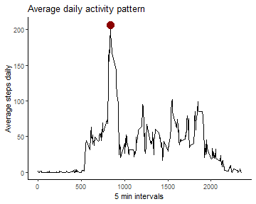
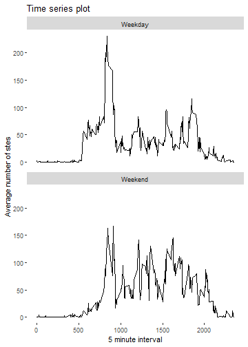

## Loading and preprocessing the data

The code below unzips the data file, loads it in R and thereafter changes the class of the date column into a date class


```r
unzip("activity.zip")

data <- read.csv("activity.csv")

data <- transform(data, date = as.Date(data$date))
```

## Mean and Total number of steps taken per day

The table below presents the total number of steps taken per each day First 5 rows of the table


date          steps
-----------  ------
2012-10-01        0
2012-10-02      126
2012-10-03    11352
2012-10-04    12116
2012-10-05    13294
2012-10-06    15420

The histogram below presents the total number of steps taken on each day


```r
  ggplot(step_day, aes(steps)) +
     geom_histogram(fill = "darkred")+
     labs(title = "Total number of steps per day",
              y = "Count of steps",
              x = "Steps") +
     theme_classic()
```

```
## `stat_bin()` using `bins = 30`. Pick better value with `binwidth`.
```



The mean and median of the total number of steps taken per day


```r
table <- matrix(NA, ncol = 2, nrow =  2)

colnames(table) <- c("Computation", "Value")

  table[1, ] <- c("Mean", mean(step_day$steps, na.rm = TRUE))
  table[2, ] <- c("Median", median(step_day$steps, na.rm = TRUE))

kable(table, format = "simple", table.attr = "style = 'width:50%;'")
```


Computation   Value            
------------  -----------------
Mean          9354.22950819672 
Median        10395            


```r
 mean_median <-  data %>% 
                      group_by(date) %>% 
                      summarise( mean = mean(steps, na.rm = TRUE),
                                   median = median(steps, na.rm = TRUE))

  kable(head(mean_median), format = "simple")
```


date              mean   median
-----------  ---------  -------
2012-10-01         NaN       NA
2012-10-02     0.43750        0
2012-10-03    39.41667        0
2012-10-04    42.06944        0
2012-10-05    46.15972        0
2012-10-06    53.54167        0

## Average daily activity pattern

Time series plot of 5 minute intervals and average numbers of steps taken, averaged across all days.


```r
   temp <- aggregate(data$steps ~ data$interval, FUN = mean)
 
   colnames(temp) <- c("interval", "avg_steps")
  
    y  <-  max(temp$avg_steps)
    
    x <- temp[temp$avg_steps == max(temp$avg_steps),1]


  data %>% 
      group_by(interval) %>% 
      summarise(average = mean(steps, na.rm = TRUE)) %>% 
      ggplot(aes(interval, average))+
          geom_line()+
          labs( title =  "Average daily activity pattern",
                x =  "5 min intervals",
                y =  "Average steps daily")+
          theme_classic() +
          geom_point(aes(x,y), cex = 5, color = "darkred")
```



The red point on the chart indicates the max average steps on 835 min intervals

## Imputing missing values


```r
rows_with_NAs <- sum(!complete.cases(data))
```

The data set has a total of 2304 missing variables.

These missing variables are replaced by the average number of steps taken in time interval across all days using the code below.

A new dataset named data2 is created with all the missing values filled.


```r
daily_pattern <- data %>% 
                    group_by(interval) %>% 
                    summarise(average = mean(steps, na.rm = TRUE))

match <- daily_pattern$average[match(data$interval, daily_pattern$interval)]


data2 <- transform(data,
                 steps = ifelse(is.na(data$steps),
                            yes = match,
                            no = data$steps))
```

Below is a histogram of the total number of steps taken each day.


```r
data2 %>% 
  group_by(date) %>% 
  summarize(total_steps = sum(steps),
            average_steps = mean(steps),
            median_steps = median(steps)) %>% 
  ggplot(aes(total_steps))+
      geom_histogram(fill = "darkred")+
      labs( title =  "Plot 2; Total number of steps taken each day",
                x =  "Steps freqency",
                y =  "Steps count")+
      theme_classic()
```

```
## `stat_bin()` using `bins = 30`. Pick better value with `binwidth`.
```

```r
ggplot(step_day, aes(steps)) +
   geom_histogram(fill = "darkred")+
   labs(title = "Plor 1; Total number of steps per day",
            y = "Count of steps",
            x = "Steps") +
   theme_classic()
```

```
## `stat_bin()` using `bins = 30`. Pick better value with `binwidth`.
```


Plot 2, on the left side shows the total number of steps after inputting the missing variables. whilst plot 1, on the right show the total number of steps per day with the missing the variables.

As you may see, imputting the missing variables has changed the outlook of the graph.

## Difference in activity pattern between weekday and weekends

Code below creates a new factor variable that indicates whether the day is a weekday or a weekend.


```r
days_table <- data.frame(day = c("Monday", "Tuesday", "Wednesday", 
                                  "Thursday", "Friday", "Saturday", "Sunday"),
                          mid_end = c("Weekday","Weekday","Weekday","Weekday","Weekday", 
                                 "Weekend", "Weekend"))

data3 <- transform(data2, day = weekdays(date))

day_end <- as.factor(days_table$mid_end[(match(data3$day, days_table$day))])

data3 <- cbind(data3, day_end)

kable(head(data3), format = "simple")
```

     steps  date          interval  day      day_end 
----------  -----------  ---------  -------  --------
 1.7169811  2012-10-01           0  Monday   Weekday 
 0.3396226  2012-10-01           5  Monday   Weekday 
 0.1320755  2012-10-01          10  Monday   Weekday 
 0.1509434  2012-10-01          15  Monday   Weekday 
 0.0754717  2012-10-01          20  Monday   Weekday 
 2.0943396  2012-10-01          25  Monday   Weekday 

Panel plot of a time series plot of the 5 minute interval and average number of steps taken, averaged across all weekday days and weekend days.


```r
data3 %>% 
  group_by(day_end, interval) %>% 
  summarise(avg = mean(steps)) %>% 
  ggplot(aes(interval, avg))+
      geom_line()+
      labs( title =  "Time series plot",
                x =  "5 minute interval",
                y =  "Average number of stes")+
      facet_wrap(.~ day_end, nrow = 2) +
      theme(panel.background = element_rect(fill='transparent'))
```

```
## `summarise()` has grouped output by 'day_end'. You can override using the `.groups` argument.
```


